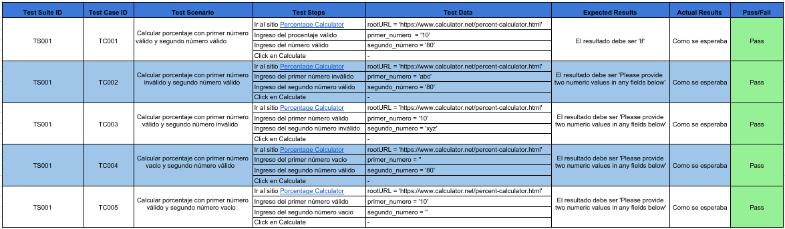
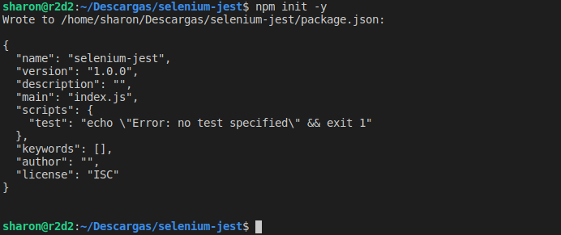
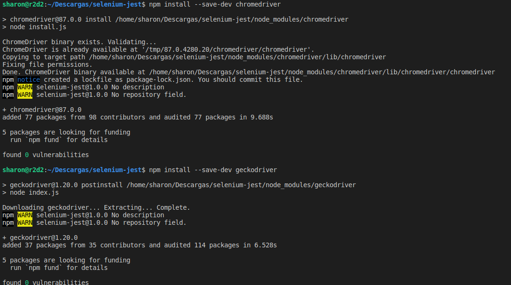
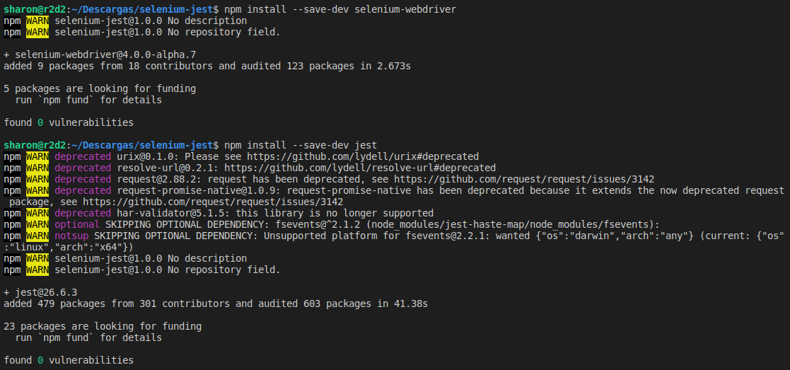
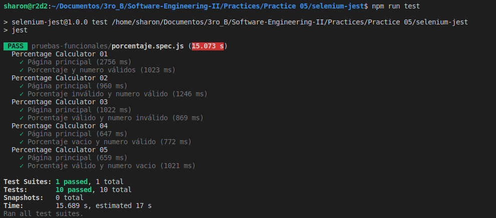

# Jest + Selenium WebDriver

<p align="center"></p>

--------------------------------------------------------------------------------

## Prerrequisitos

Antes de comenzar, debemos tener instalado Node.js y su gestor de paquetes, npm.
- [Node.js](https://nodejs.org/es/)
- [npm](https://docs.npmjs.com/downloading-and-installing-node-js-and-npm)

## Diseño de los casos de prueba

Diseño de los casos de prueba para la funcionalidad "Percentage Calculator" ([Diseño-de-casos-de-prueba](https://docs.google.com/spreadsheets/d/1wwuniNtFZw4hUCLiqm30Jf7h0U16iarQPHLH3FTX5WU/edit?usp=sharing))

<p align="center"></p>

## Automatización de pruebas funcionales

Creamos un directorio con el nombre selenium-jest y entramos al directorio.

```bash
$ mkdir selenium-jest
$ cd selenium-jest
```
Creamos el archivo package.json corriendo el siguiente comando.

```bash
$ npm init -y
```

<p align="center"></p>

Luego, instalamos localmente en nuestro proyecto lo siguiente.

- chromedriver
- geckodriver
- selenium-webdriver
- Jest


```bash
$ npm install --save-dev chromedriver
$ npm install --save-dev geckodriver
$ npm install --save-dev selenium-webdriver
$ npm install --save-dev jest
```
<p align="center"></p>

<p align="center"></p>

Configuramos de la siguiente manera nuestro archivo package.json .

```json
{
  "name": "selenium-jest",
  "version": "1.0.0",
  "description": "",
  "main": "index.js",
  "scripts": {
    "test": "jest"
  },
  "repository": {
    "type": "git",
    "url": "git+https://github.com/sharon1160/selenium-jest.git"
  },
  "keywords": [],
  "author": "SharonChR",
  "license": "ISC",
  "bugs": {
    "url": "https://github.com/sharon1160/selenium-jest/issues"
  },
  "homepage": "https://github.com/sharon1160/selenium-jest#readme",
  "devDependencies": {
    "chromedriver": "^87.0.0",
    "geckodriver": "^1.20.0",
    "jest": "^26.6.3",
    "selenium-webdriver": "^4.0.0-alpha.7"
  }
}

```

Creamos nuestro archivo de configuración jest.config.js y colocamos el siguiente contenido.

```javascript
module.exports = {
    testPathIgnorePatterns: ['<rootDir>/node_modules/'],
    testRegex: '(/test/.*|(\\.|/)(test|spec))\\.jsx?$',
    bail: false,
    verbose: true
};
```
Realizaremos pruebas en la página web [Calculator.net](https://www.calculator.net/); para esto, creamos el directorio pruebas-funcionales, dentro de este directorio implementaremos nuestras pruebas funcionales con la extension .spec.js; Jest solo leerá archivos con esa extensión, tal y como esta definido en nuestro archivo jest.config.js .

- Porcentaje.spec.js : Pruebas con entradas y resultado esperado en [Percentage Calculator](https://www.calculator.net/percent-calculator.html).

```javascript
const { Builder } = require('selenium-webdriver')
const { getElementById, getElementByXPath } = require('./utilidades')
require('selenium-webdriver/chrome')
require('selenium-webdriver/firefox')
require('chromedriver')
require('geckodriver')

jasmine.DEFAULT_TIMEOUT_INTERVAL = 1000 * 60 * 5

let driver

beforeAll(async () => {
  driver = await new Builder().forBrowser('firefox').build()
})

afterAll(async () => driver.quit())

const rootURL = 'https://www.calculator.net/percent-calculator.html';
var a,b,boton,resultado
var a2,b2,boton2,resultado2
var a3,b3,boton3,resultado3
var a4,b4,boton4,resultado4
var a5,b5,boton5,resultado5

describe('Percentage Calculator 01', () => {
  test('Página principal', async () => {
    await driver.get(rootURL)
  });

  test('Porcentaje y numero válidos', async () => {
    // Enter  a value in the first number of the percent Calculator
    a = await getElementById('cpar1', driver);
    await a.sendKeys('10');
    
    // Enter a value in the second number of the percent Calculator
    b = await getElementById('cpar2', driver);
    await b.sendKeys('80');

    // Click Calculate Button
    boton = await getElementByXPath('/html/body/div[3]/div[1]/table[1]/tbody/tr[2]/td/input[2]', driver)
    await boton.click()

    // Compare expected result with current result
    resultado = await getElementByXPath('/html/body/div[3]/div[1]/p[2]/font/b', driver)
    const actual = await resultado.getText()
    const expected = '8'
    expect(actual).toEqual(expected)
  });

});

describe('Percentage Calculator 02', () => {
  test('Página principal', async () => {
    await driver.get(rootURL)
  });

  test('Porcentaje inválido y numero válido', async () => {
    // Enter  a value in the first number of the percent Calculator
    a2 = await getElementById('cpar1', driver);
    await a2.sendKeys('abc');
    
    // Enter a value in the second number of the percent Calculator
    b2 = await getElementById('cpar2', driver);
    await b2.sendKeys('80');

    // Click Calculate Button
    boton2 = await getElementByXPath('/html/body/div[3]/div[1]/table[1]/tbody/tr[2]/td/input[2]', driver)
    await boton2.click()

    // Compare expected result with current result
    resultado2 = await getElementByXPath('/html/body/div[3]/div[1]/p[2]/font', driver)
    const actual2 = await resultado2.getText()
    const expected2 = 'Please provide two numeric values in any fields below.'
    expect(actual2).toEqual(expected2)
  });

});

describe('Percentage Calculator 03', () => {
  test('Página principal', async () => {
    await driver.get(rootURL)
  });

  test('Porcentaje válido y numero inválido', async () => {
    // Enter  a value in the first number of the percent Calculator
    a3 = await getElementById('cpar1', driver);
    await a3.sendKeys('10');
    
    // Enter a value in the second number of the percent Calculator
    b3 = await getElementById('cpar2', driver);
    await b3.sendKeys('xyz');

    // Click Calculate Button
    boton3 = await getElementByXPath('/html/body/div[3]/div[1]/table[1]/tbody/tr[2]/td/input[2]', driver)
    await boton3.click()

    // Compare expected result with current result
    resultado3 = await getElementByXPath('/html/body/div[3]/div[1]/p[2]/font', driver)
    const actual3 = await resultado3.getText()
    const expected3 = 'Please provide two numeric values in any fields below.'
    expect(actual3).toEqual(expected3)
  });
});

describe('Percentage Calculator 04', () => {
  test('Página principal', async () => {
    await driver.get(rootURL)
  });

  test('Porcentaje vacio y numero válido', async () => {
    // Enter  a value in the first number of the percent Calculator
    a4 = await getElementById('cpar1', driver);
    await a4.sendKeys('');
    
    // Enter a value in the second number of the percent Calculator
    b4 = await getElementById('cpar2', driver);
    await b4.sendKeys('80');

    // Click Calculate Button
    boton4 = await getElementByXPath('/html/body/div[3]/div[1]/table[1]/tbody/tr[2]/td/input[2]', driver)
    await boton4.click()

    // Compare expected result with current result
    resultado4 = await getElementByXPath('/html/body/div[3]/div[1]/p[2]/font', driver)
    const actual4 = await resultado4.getText()
    const expected4 = 'Please provide two numeric values in any fields below.'
    expect(actual4).toEqual(expected4)
  });
});

describe('Percentage Calculator 05', () => {
  test('Página principal', async () => {
    await driver.get(rootURL)
  });

  test('Porcentaje válido y numero vacio', async () => {
    // Enter  a value in the first number of the percent Calculator
    a5 = await getElementById('cpar1', driver);
    await a5.sendKeys('10');
    
    // Enter a value in the second number of the percent Calculator
    b5 = await getElementById('cpar2', driver);
    await b5.sendKeys('');

    // Click Calculate Button
    boton5 = await getElementByXPath('/html/body/div[3]/div[1]/table[1]/tbody/tr[2]/td/input[2]', driver)
    await boton5.click()

    // Compare expected result with current result
    resultado5 = await getElementByXPath('/html/body/div[3]/div[1]/p[2]/font', driver)
    const actual5 = await resultado5.getText()
    const expected5 = 'Please provide two numeric values in any fields below.'
    expect(actual5).toEqual(expected5)
  });
});
```
Y creamos el archivo utilidades.js, este contendrá funciones de utilidad : 

- querySelector
- getElementById
- getElementByXPath

```javascript
const { By, until } = require('selenium-webdriver')

const waitUntilTime = 20000

// funciones de utilidad
async function getElementById(id, driver) {  
    const el = await driver.wait(until.elementLocated(By.id(id)), waitUntilTime)  

    return await driver.wait(until.elementIsVisible(el), waitUntilTime
)}

async function getElementByXPath(xpath, driver) {  
    const el = await driver.wait(until.elementLocated(By.xpath(xpath)), waitUntilTime)  
    return await driver.wait(until.elementIsVisible(el), waitUntilTime
)}

async function querySelector(selector, driver) {
    const el = await driver.wait(
      until.elementLocated(By.css(selector)),
      waitUntilTime
    )
    return await driver.wait(until.elementIsVisible(el), waitUntilTime)
}

module.exports = {
    querySelector,
    getElementById,
    getElementByXPath
}
```
Finalmente, ejecutamos las pruebas con el siguiente comando.

```bash
$ npm run test
```
<p align="center"></p>

