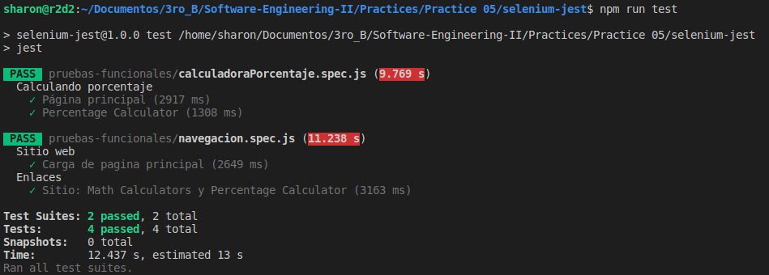

# Jest + Selenium WebDriver

<p align="center"></p>

--------------------------------------------------------------------------------

## Prerrequisitos

Antes de comenzar, debemos tener instalado Node.js y su gestor de paquetes, npm.
- [Node.js](https://nodejs.org/es/)
- [npm](https://docs.npmjs.com/downloading-and-installing-node-js-and-npm)

## Automatización de pruebas funcionales

Creamos un directorio con el nombre selenium-jest y entramos al directorio.

```bash
$ mkdir selenium-jest
$ cd selenium-jest
```
Creamos el archivo package.json corriendo el siguiente comando.

```bash
$ npm init -y
```

<p align="center"></p>

Luego, instalamos localmente en nuestro proyecto lo siguiente.

- chromedriver
- geckodriver
- selenium-webdriver
- Jest


```bash
$ npm install --save-dev chromedriver
$ npm install --save-dev geckodriver
$ npm install --save-dev selenium-webdriver
$ npm install --save-dev jest
```
<p align="center"></p>

<p align="center"></p>

Configuramos de la siguiente manera nuestro archivo package.json .

```json
{
  "name": "selenium-jest",
  "version": "1.0.0",
  "description": "",
  "main": "index.js",
  "scripts": {
    "test": "jest"
  },
  "repository": {
    "type": "git",
    "url": "git+https://github.com/sharon1160/selenium-jest.git"
  },
  "keywords": [],
  "author": "SharonChR",
  "license": "ISC",
  "bugs": {
    "url": "https://github.com/sharon1160/selenium-jest/issues"
  },
  "homepage": "https://github.com/sharon1160/selenium-jest#readme",
  "devDependencies": {
    "chromedriver": "^87.0.0",
    "geckodriver": "^1.20.0",
    "jest": "^26.6.3",
    "selenium-webdriver": "^4.0.0-alpha.7"
  }
}

```

Creamos nuestro archivo de configuración jest.config.js y colocamos el siguiente contenido.

```javascript
module.exports = {
    testPathIgnorePatterns: ['<rootDir>/node_modules/'],
    testRegex: '(/test/.*|(\\.|/)(test|spec))\\.jsx?$',
    bail: false,
    verbose: true
};
```
Realizaremos pruebas en la página web [Calculator.net](https://www.calculator.net/); para esto, creamos el directorio pruebas-funcionales, dentro de este directorio implementaremos nuestras pruebas funcionales con la extension .spec.js; Jest solo leerá archivos con esa extensión, tal y como esta definido en nuestro archivo jest.config.js .

- navegacion.spec.js : Pruebas de navegación en Calculator.net (clicks)

```javascript
const { Builder } = require('selenium-webdriver')
const { getElementByXPath } = require('./utilidades')
require('selenium-webdriver/chrome')
require('selenium-webdriver/firefox')
require('chromedriver')
require('geckodriver')

let driver

jasmine.DEFAULT_TIMEOUT_INTERVAL = 1000 * 60 * 5

beforeAll(async () => {
  driver = await new Builder().forBrowser('firefox').build()
})

const paginaweb = 'https://www.calculator.net/'
var el

describe('Sitio web', () => {
  // Carga contenido de la pagina principal
  test('Carga de pagina principal', async () => {
    await driver.get(paginaweb)
  });
});

describe('Enlaces', () => {
  test('Sitio: Math Calculators y Percentage Calculator', async () => {
    // Click en Math Calculators
    el = await getElementByXPath('/html/body/div[4]/div/table/tbody/tr/td[3]/div[2]/a', driver)
    await el.click()

    // Click en Percent Calculator
    el = await getElementByXPath('/html/body/div[3]/div[1]/table[2]/tbody/tr/td/div[3]/a', driver)
    await el.click()
  });
});


afterAll(async () => driver.quit())
```
- calculadorPorcentaje.spec.js : Pruebas con entradas y resultado esperado en [Percentage Calculator](https://www.calculator.net/percent-calculator.html).

```javascript
const { Builder } = require('selenium-webdriver')
const { getElementById, getElementByXPath } = require('./utilidades')
require('selenium-webdriver/chrome')
require('selenium-webdriver/firefox')
require('chromedriver')
require('geckodriver')

jasmine.DEFAULT_TIMEOUT_INTERVAL = 1000 * 60 * 5

let driver

beforeAll(async () => {
  driver = await new Builder().forBrowser('firefox').build()
})

afterAll(async () => driver.quit())

const rootURL = 'https://www.calculator.net/percent-calculator.html';
var a,b,boton,resultado

describe('Calculando porcentaje', () => {
  test('Página principal', async () => {
    await driver.get(rootURL)
  });

  test('Percentage Calculator', async () => {
    // Asegura que el id haya terminado de cargar
    a = await getElementById('cpar1', driver);
    await a.sendKeys('10');
    
    // Asegura que el id haya terminado de cargar
    b = await getElementById('cpar2', driver);
    await b.sendKeys('50');

    // Asegura que el xpath haya terminado de cargar
    boton = await getElementByXPath('/html/body/div[3]/div[1]/table[1]/tbody/tr[2]/td/input[2]', driver)
    await boton.click()

    // Asegura que el xpath haya terminado de cargar
    resultado = await getElementByXPath('/html/body/div[3]/div[1]/p[2]/font/b', driver)
    const actual = await resultado.getText()
    const expected = '5'
    expect(actual).toEqual(expected)
  });
});
```
Y creamos el archivo utilidades.js, este contendrá funciones de utilidad : 

- querySelector
- getElementById
- getElementByXPath

```javascript
const { By, until } = require('selenium-webdriver')

const waitUntilTime = 20000

// funciones de utilidad
async function getElementById(id, driver) {  
    const el = await driver.wait(until.elementLocated(By.id(id)), waitUntilTime)  

    return await driver.wait(until.elementIsVisible(el), waitUntilTime
)}

async function getElementByXPath(xpath, driver) {  
    const el = await driver.wait(until.elementLocated(By.xpath(xpath)), waitUntilTime)  
    return await driver.wait(until.elementIsVisible(el), waitUntilTime
)}

async function querySelector(selector, driver) {
    const el = await driver.wait(
      until.elementLocated(By.css(selector)),
      waitUntilTime
    )
    return await driver.wait(until.elementIsVisible(el), waitUntilTime)
}

module.exports = {
    querySelector,
    getElementById,
    getElementByXPath
}
```
Finalmente, ejecutamos las pruebas con el siguiente comando.

```bash
$ npm run test
```
<p align="center"></p>

